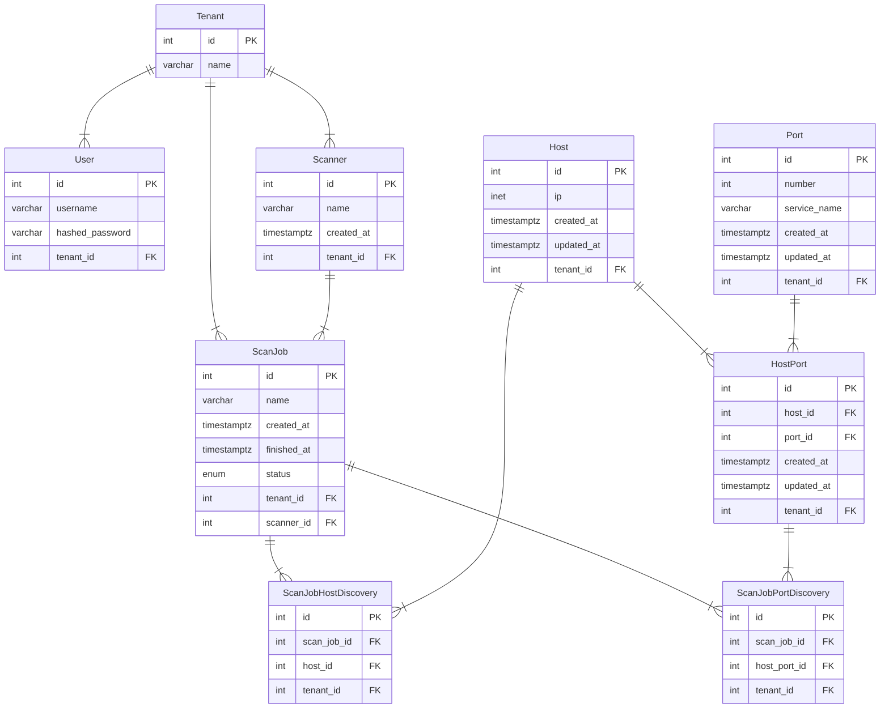

```mermaid
erDiagram
    Tenant {
        int id PK
        varchar name
    }
    User {
        int id PK
        varchar username
        varchar hashed_password
        int tenant_id FK
    }
    Scanner {
        int id PK
        varchar name
        timestamptz created_at
        int tenant_id FK
    }
    ScanJob {
        int id PK
        varchar name
        timestamptz created_at
        timestamptz finished_at
        enum status
        int tenant_id FK
        int scanner_id FK
    }
    Host {
        int id PK
        inet ip
        timestamptz created_at
        timestamptz updated_at
        int tenant_id FK
    }
    Port {
        int id PK
        int number
        varchar service_name
        timestamptz created_at
        timestamptz updated_at
        int tenant_id FK
    }
    HostPort {
        int id PK
        int host_id FK
        int port_id FK
        timestamptz created_at
        timestamptz updated_at
        int tenant_id FK
    }
    ScanJobHostDiscovery {
        int id PK
        int scan_job_id FK
        int host_id FK
        int tenant_id FK
    }
    ScanJobPortDiscovery {
        int id PK
        int scan_job_id FK
        int host_port_id FK
        int tenant_id FK
    }

    Tenant ||--|{ User : ""
    Tenant ||--|{ Scanner : ""
    Tenant ||--|{ ScanJob : ""
    Scanner ||--|{ ScanJob : ""
    Host ||--|{ HostPort : ""
    Port ||--|{ HostPort : ""
    ScanJob ||--|{ ScanJobHostDiscovery : ""
    ScanJob ||--|{ ScanJobPortDiscovery : ""
    Host ||--|{ ScanJobHostDiscovery : ""
    HostPort ||--|{ ScanJobPortDiscovery : ""
```